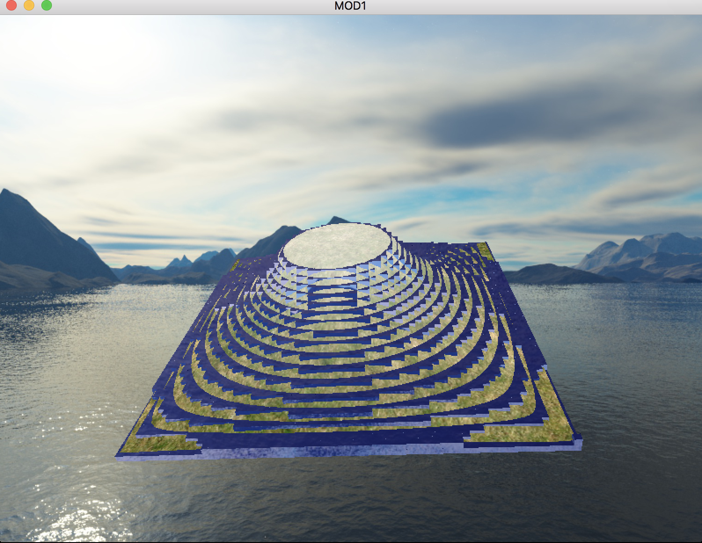

# Mod1

Terrain and water flow simulation project

# Todo
--- Use gl_Instanced Rendering for Fast Cubes Rendering
 
--- handle collisision in Integrate kernels
 
--- Implement scenarios
 

Sources 
https://bigtheta.io/2016/05/23/particle-based-fluid-simulation.html
 
https://learnopengl.com
 
https://en.wikipedia.org/wiki/Inverse_distance_weighting
